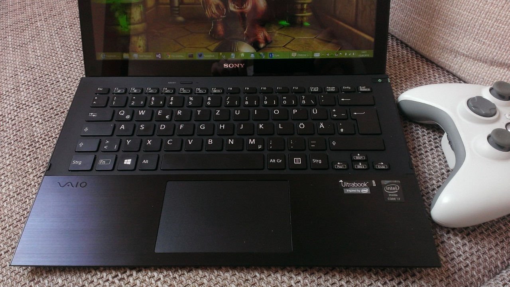



Configuration reviewed:

- i7-4500U CPU
- 8 GB RAM
- 256 GB SSD
- 2nd extended battery
- Touch Screen

Ever since the Haswell chipset was first announced, I was intrigued by the battery-life-to-performance ratio. Who wouldn't like the idea of coding all day long without having to dig up the power cord? Since I did some iOS programming on a Macbook Air recently, I had some high expectations for a solid Windows Ultrabook. The Vaio Pro 13 claims to be the lightest device of its class while also packing some serious firepower. Let's see how it's holding up.

##What I like

As one should expect from a Haswell Ultrabook, portability and battery life are excellent. With the extended battery attached (it was free for a limited time when purchasing from the sony online store) I can easily get 10-12 hours of office work in battery saving mode. In fact, I never really remove the extended battery anymore since it doesn't really add a lot of weight to the super light laptop. When doing some Web development with Visual Studio 2012 and the Azure Tools I can get about 6-9 hours but since Haswell is really good at saving "idle" energy this number is not that accurate. For example, while writing this review, the battery indicator switched from 12 hours left to 16 hours left and back. For coding, I usually enable "balanced mode" since the cpu limit can really be felt in battery saving mode. Tip: Dimming the screen even a little bit has a large impact on battery life.

The full HD touch screen is very nice when setting the windows screen scaling to 125%- I absolutely wanted to have a full HD screen for working with VS. I never really hated Windows 8, in fact, I've been running it on my home PC since before it was released to the general public. With a touch screen laptop however, it really shines. Of course you won't use it when working on the desktop but I love swiping through some Metro Apps like News or Weather. When going back to my non-touch work laptop, it felt kind of odd, as if something was missing.

Another benefit of running Win 8 (and an excellent SSD) is the incredibly fast boot time: From cold-boot to ready in 4 seconds. Shutting down the system or going to hibernate is not that fast, though.

The keyboard also is excellent and never makes you miss the Macbook Air. The touch pad is another story but more of that later on.

##What I don't like

Even if the build quality of the carbon fiber frame is great, I'm not so excited about the stability of the screen. The hinges supporting it feel a bit weak and do not allow it to be pushed back all the way. I am also not that comfortable with shoving the laptop in any bag and forget about it like I did with the Air. It just does not feel as rock solid as Apple's device. Take the touch pad, for example: Although it performs really well there is one glaring issue: The pad can perform a mechanical "click" and a "touch click". When the PC rests on top of your lap the thin construction of the frame performs a mechanical click from the bottom up, effectively causing a permanent click. I had to revert to "touch click only" to eliminate this issue.

With great power comes great fan noise. At least when it comes to Windows laptops. The Macbook Air was silent except when doing 100% CPU intensive processing for a couple of minutes. The Vaio Pro however will happily power up the fan whenever the cpu load is above 10%. An unsteady noise level can be observed when Windows is running background tasks like security scans or when compiling and debugging projects. Luckily it remains OK for normal Visual Studio work.  The device is only really silent when idling on the desktop or doing some light web browsing. Watching an HD movie will at least trigger a moderate level of fan noise. Prepare to be assaulted by the fan when switching to high performance mode, even for light work.

##Miscellaneous

The Vaio Pro 13 sports two USB 3.0 ports and a full sized HDMI port as well as a headphone jack and an SD card reader. I removed the pre-installed Windows 8 and installed Windows 8 Enterprise Edition on it which is possible via the Assist Key on the laptop. When it comes to gaming I only installed the recently released Shadowrun Returns which was running nice and surprisingly long (3 hours on battery) on it. HD 4400 graphics should be sufficient for some casual or older games. There are some complaints circulating about WiFi issues. I also had some trouble with a router at my friend's place - primarily disconnects - but that was solved by the latest [driver update](http://www.sony.de/support/de/product/SVP1321A4E/updates) from Sony.

##Bottom Line

It's not perfect but it did deliver the key elements I wanted out of a Haswell laptop. If you crave absolute silence then this is probably not the device you're after but if you're a programmer with an aversion for power cords you might want to take a look at it.

